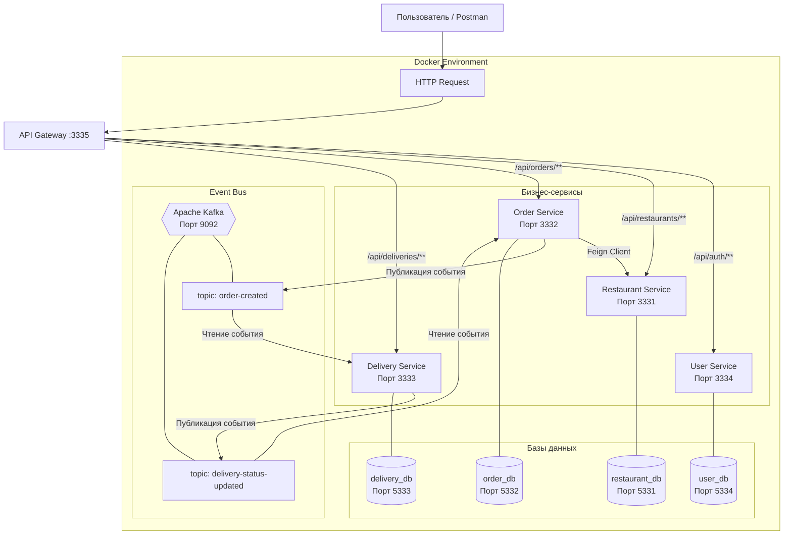

# DeliveryHub - Микросервисная платформа доставки еды

<div align="center">


</div>

## Принцип работы
```text
1. Пользователь авторизуется через User Service, получает JWT-токен.
2. Просматривает рестораны и меню через Restaurant Service.
3. Создаёт заказ через Order Service (JWT обязателен).
4. Order Service проверяет ресторан и блюда по HTTP (Feign), сохраняет заказ и отправляет событие OrderCreatedEvent в Kafka.
5. Delivery Service получает событие, автоматически создаёт доставку и отправляет обратное событие DeliveryStatusUpdatedEvent.
6. Order Service обновляет статус заказа.
```

## Архитектура системы



## Технологический стек

| Категория            | Технологии                          |
|:---------------------|:------------------------------------|
| **Язык**             | Java 25                             |
| **Фреймворк**        | Spring Boot 3.4.5                   |
| **Микросервисы**     | Spring Cloud (OpenFeign, Gateway)   |
| **Асинхронность**    | Apache Kafka                        |
| **Базы данных**      | PostgreSQL (4 отдельных БД)         |
| **Миграции**         | Flyway                              |
| **Безопасность**     | Spring Security + JWT (jjwt 0.13.0) |
| **Документирование** | SpringDoc OpenAPI (Swagger UI)      |
| **Сборка**           | Gradle 9.3 + Kotlin DSL             |
| **Контейнеризация**  | Docker + Docker Compose             |

## 🐳 Быстрый старт

### Запуск всего проекта одной командой
```bash
git clone https://github.com/nmaksimka/Delivery-Hub.git
cd Delivery-Hub
docker-compose up --build
Доступные сервисыСервисURLAPI Gateway (Swagger)http://localhost:3335/swagger-ui.htmlUser Servicehttp://localhost:3334/swagger-ui.htmlOrder Servicehttp://localhost:3332/swagger-ui.htmlPostgreSQL (user)localhost:5334
```
## Примеры API запросов (Postman)
### Тестирование API
#### 1. Регистрация
```markdown
```http
POST http://localhost:3335/api/auth/register
Content-Type: application/json

{
  "email": "test@example.com",
  "password": "123456",
  "name": "Test User",
  "phone": "+79991234567"
}
```
#### 2. Создание заказа (JWT)
```markdown
HTTP
POST http://localhost:3335/api/orders
Content-Type: application/json
Authorization: Bearer <your_token>

{
    "userId": 1,
    "restaurantId": 1,
    "orderItemsRequest": [{"menuItemId": 1, "quantity": 2}]
}
```

### 📂 Структура проекта

```text
DeliveryHub/
├── apiGateway/          # Gateway + JWT фильтр
├── userService/         # Auth & Users
├── orderService/        # Orders (Feign + Kafka)
├── deliveryService/     # Delivery (Kafka)
├── restaurantService/   # Catalog & Menu
└── docker-compose.yml   # Infrastructure
```

