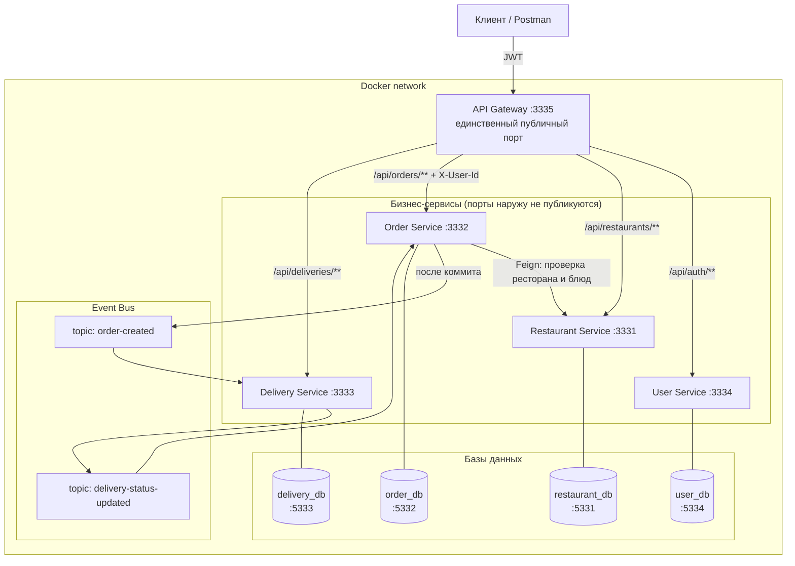

# DeliveryHub — микросервисная платформа доставки еды

<div align="center">


</div>

Пять сервисов, у каждого своя БД. Синхронное взаимодействие — через Feign,
асинхронное — через Kafka. Единственная публичная точка входа — API Gateway.

## Как это работает

1. Пользователь регистрируется и логинится в **User Service**, получает JWT.
   В токене лежат `sub` (email), `uid` (id пользователя) и `role`.
2. **API Gateway** проверяет подпись токена и пробрасывает личность вниз
   заголовками `X-User-Id` / `X-User-Email` / `X-User-Role`. Входящие заголовки
   `X-User-*` от клиента всегда затираются — подделать их нельзя.
3. Каталог ресторанов и меню читается из **Restaurant Service** без токена;
   изменять каталог может только `ADMIN`.
4. **Order Service** создаёт заказ. `userId` берётся из токена, а не из тела запроса.
   Ресторан и каждая позиция меню проверяются по HTTP (Feign) — в том числе то,
   что блюдо принадлежит именно этому ресторану.
5. После **коммита транзакции** заказа публикуется `OrderCreatedEvent`.
6. **Delivery Service** читает событие, идемпотентно создаёт доставку и публикует
   `DeliveryStatusUpdatedEvent` — как при автосоздании, так и при ручной смене статуса.
7. **Order Service** переводит заказ в свой статус (`ASSIGNED` доставки → `CONFIRMED` заказа).

## Архитектура


```mermaid
graph TB
    Client[Клиент / Postman]

    subgraph Docker["Docker network"]
        Gateway[API Gateway :3335<br/>единственный публичный порт]

        subgraph Services["Бизнес-сервисы (порты наружу не публикуются)"]
            Restaurant[Restaurant Service :3331]
            Order[Order Service :3332]
            Delivery[Delivery Service :3333]
            User[User Service :3334]
        end

        subgraph DBs["Базы данных"]
            DB1[(restaurant_db<br/>:5331)]
            DB2[(order_db<br/>:5332)]
            DB3[(delivery_db<br/>:5333)]
            DB4[(user_db<br/>:5334)]
        end

        subgraph Bus["Event Bus"]
            Topic1["topic: order-created"]
            Topic2["topic: delivery-status-updated"]
        end
    end

    Client -->|JWT| Gateway
    Gateway -->|"/api/auth/**"| User
    Gateway -->|"/api/restaurants/**"| Restaurant
    Gateway -->|"/api/orders/** + X-User-Id"| Order
    Gateway -->|"/api/deliveries/**"| Delivery

    Order -->|Feign: проверка ресторана и блюд| Restaurant
    Order -->|после коммита| Topic1
    Topic1 --> Delivery
    Delivery --> Topic2
    Topic2 --> Order

    Restaurant --- DB1
    Order --- DB2
    Delivery --- DB3
    User --- DB4
```

## Технологический стек

| Категория            | Технологии                                     |
|:---------------------|:-----------------------------------------------|
| **Язык**             | Java 21                                        |
| **Фреймворк**        | Spring Boot 3.4.5                              |
| **Микросервисы**     | Spring Cloud Gateway, OpenFeign                |
| **Асинхронность**    | Apache Kafka (+ DLT и ограниченные повторы)    |
| **Базы данных**      | PostgreSQL, по одной на сервис                 |
| **Миграции**         | Flyway (`ddl-auto: validate`)                  |
| **Безопасность**     | Spring Security + JWT (jjwt 0.13.0)            |
| **Документация**     | SpringDoc OpenAPI, агрегация на гейтвее        |
| **Тесты**            | JUnit 5 + Mockito + AssertJ                    |
| **Метрики**          | Actuator + Micrometer + Prometheus             |
| **Сборка**           | Gradle 9.3 (Kotlin DSL), общий каталог версий  |

## Быстрый старт

```bash
git clone https://github.com/nmaksimka/Delivery-Hub.git
cd Delivery-Hub
cp .env.example .env      # обязательно: задайте JWT_SECRET
docker compose up --build
```

`JWT_SECRET` обязателен — без него compose не стартует. Секрет должен быть
не короче 32 байт и одинаковым для `userService` и `apiGateway`:

```bash
openssl rand -base64 48
```

### Доступные адреса

| Что                      | Адрес                                  |
|:-------------------------|:---------------------------------------|
| API Gateway              | http://localhost:3335                  |
| Swagger UI (все сервисы) | http://localhost:3335/swagger-ui.html  |
| Prometheus               | http://localhost:9090                  |
| PostgreSQL (order)       | localhost:5332                         |

Порты 3331–3334 наружу не публикуются: обращаться к сервисам напрямую в обход
авторизации гейтвея нельзя. Порты БД оставлены для локальной разработки.

> Схему держит Flyway, а Hibernate работает в режиме `validate`. Если вы
> поднимали проект на старых миграциях, пересоздайте тома:
> `docker compose down -v`.

## Примеры запросов

### 1. Регистрация

```http
POST http://localhost:3335/api/auth/register
Content-Type: application/json

{
  "email": "test@example.com",
  "password": "secret123",
  "name": "Test User",
  "phone": "+79991234567"
}
```

### 2. Логин

```http
POST http://localhost:3335/api/auth/login
Content-Type: application/json

{
  "email": "test@example.com",
  "password": "secret123"
}
```

Ответ содержит `token` — его подставляем в заголовок `Authorization`.

### 3. Создание заказа

```http
POST http://localhost:3335/api/orders
Content-Type: application/json
Authorization: Bearer <token>

{
  "restaurantId": 1,
  "orderItemsRequest": [
    { "menuItemId": 1, "quantity": 2 }
  ]
}
```

`userId` в теле нет — сервис берёт его из токена.

### 4. Свои заказы

```http
GET http://localhost:3335/api/orders?page=0&size=20
Authorization: Bearer <token>
```

### 5. Смена статуса доставки (ADMIN / COURIER)

```http
PATCH http://localhost:3335/api/deliveries/1/status
Content-Type: application/json
Authorization: Bearer <token>

{ "status": "IN_TRANSIT" }
```

Заказ получит событие и перейдёт в `IN_DELIVERY`.

## Модель доступа

| Эндпоинт                        | Кто может                |
|:--------------------------------|:-------------------------|
| `POST /api/auth/**`             | все                      |
| `GET /api/restaurants/**`       | все                      |
| `POST/PUT/DELETE /api/restaurants/**` | `ADMIN`            |
| `POST /api/orders`              | любой авторизованный     |
| `GET /api/orders`               | свои заказы              |
| `GET /api/orders/{id}`          | владелец или `ADMIN`     |
| `GET /api/orders/all`           | `ADMIN`                  |
| `PATCH /api/deliveries/*/status`| `ADMIN`, `COURIER`       |

## Статусы

- **Заказ**: `CREATED` → `CONFIRMED` → `IN_DELIVERY` → `DELIVERED` / `CANCELLED`
- **Доставка**: `ASSIGNED` → `PICKED_UP` → `IN_TRANSIT` → `DELIVERED` / `CANCELLED`

Это разные словари: статус доставки не записывается в заказ напрямую,
а транслируется через `OrderStatusResolver`.

## Тесты

```bash
./gradlew test
```

Юнит-тесты на JUnit 5 + Mockito покрывают бизнес-логику каждого сервиса:
расчёт суммы заказа, проверку владельца заказа, идемпотентность обработки
событий, изоляцию меню по ресторану, выпуск и валидацию JWT, а также защиту
гейтвея от подделки заголовков `X-User-*`.

## Структура проекта

```text
DeliveryHub/
├── apiContracts/        # общие события и enum-ы для Kafka
├── apiGateway/          # маршрутизация, проверка JWT, роли
├── userService/         # регистрация, логин, выпуск JWT
├── restaurantService/   # каталог ресторанов и меню
├── orderService/        # заказы (Feign + Kafka)
├── deliveryService/     # доставки (Kafka)
├── prometheus/          # конфигурация сбора метрик
├── buildSrc/            # версии и зависимости в одном месте
└── docker-compose.yml
```

## Что можно доработать

- Transactional outbox вместо публикации `AFTER_COMMIT` — гарантия at-least-once
  при падении между коммитом и отправкой в Kafka.
- Интеграционные тесты на Testcontainers (зависимости уже подключены).
- Обновление Spring Boot до ветки с официальной поддержкой Java 25.
- Kafka в режиме KRaft вместо ZooKeeper.
